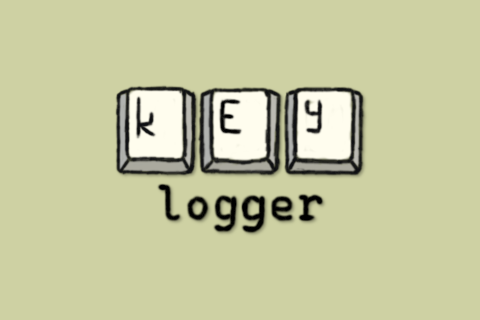

# Keylogger

_Documentation coming soon!_

## Known issues

### Keylogger

- Date might not be real or valid, so validity should be ensured
- Weird warning ocurrs before build when using WriteFile(). After build, it goes away

### Interpreter

- Path handling is pretty much non-existent
- Backspaces are not treated well
- Some sort of isNumeric() function needs implementation
- Shortcuts need a bit of work

## License

This project is licensed under the terms of the GPL-3.0 license. See the [LICENSE](LICENSE) file.
